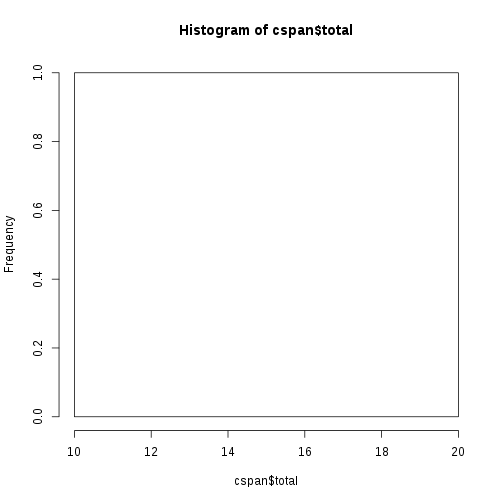
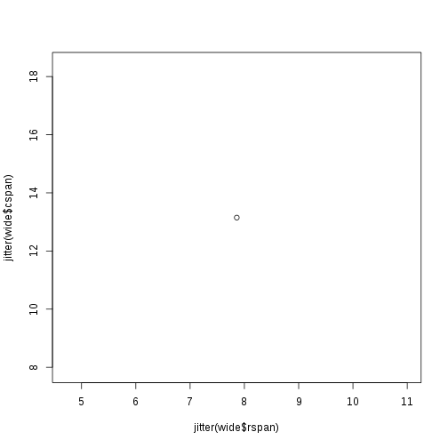

# Analysis of OpenSesame log files

## Part 1: Read the log files into R


```r
# this is the directory where the zip file gets unzipped to
datadir <- 'data'

unzip("sample_data.zip", exdir=datadir)
```


```r
library(plyr)

# function first:

read_csv_filename <- function(filename)
{
  tryCatch( 
  {  
    assign("ret", read.csv(filename, header = TRUE, row.names=NULL, stringsAsFactors=FALSE), envir=.GlobalEnv) 
  },
  warning = function( w )
  {
     print()# dummy warning function to suppress the output of warnings
  },
  error = function( err ) 
  {
    print(paste("Could not read data from", filename, ": ", err))
  })

  ret$Source <- filename
  ret
}

filenames <- dir(datadir, pattern = '*.csv', full.names = TRUE)
length(filenames)
```

```
## [1] 1
```

```r
myData <- ldply(filenames, read_csv_filename)

head(myData)
```

```
##   correct_letters correct_responseStr entered_text given_name letter
## 1            <NA>                <NA>            7         NA   <NA>
## 2            <NA>                <NA>           78         NA   <NA>
## 3            <NA>                <NA>          787         NA   <NA>
## 4            <NA>                <NA>         7877         NA   <NA>
## 5            <NA>                <NA>         7877         NA   <NA>
## 6            <NA>                <NA>         7877         NA   <NA>
##   letters_entered level responseString response_TrueFalse_choice
## 1              NA    NA           <NA>                        NA
## 2              NA    NA           <NA>                        NA
## 3              NA    NA           <NA>                        NA
## 4              NA    NA           <NA>                        NA
## 5              NA    NA           <NA>                        NA
## 6              NA    NA           <NA>                        NA
##   response_number_choice response_response response_time_TrueFalse_choice
## 1                     NA                NA                             NA
## 2                     NA                NA                             NA
## 3                     NA                NA                             NA
## 4                     NA                NA                             NA
## 5                     NA                NA                             NA
## 6                     NA                NA                             NA
##   response_time_number_choice response_time_ready_to_begin
## 1                          NA                           NA
## 2                          NA                           NA
## 3                          NA                           NA
## 4                          NA                           NA
## 5                          NA                           NA
## 6                          NA                           NA
##   response_time_response rlevel rrepetition rwrong_answers sentenceText
## 1                     NA     NA          NA             NA         <NA>
## 2                     NA     NA          NA             NA         <NA>
## 3                     NA     NA          NA             NA         <NA>
## 4                     NA     NA          NA             NA         <NA>
## 5                     NA     NA          NA             NA         <NA>
## 6                     NA     NA          NA             NA         <NA>
##   sentenceTrue sentence_number subject_nr time_dummy_delay
## 1           NA              NA        888               NA
## 2           NA              NA        888               NA
## 3           NA              NA        888               NA
## 4           NA              NA        888               NA
## 5           NA              NA        888               NA
## 6           NA              NA        888               NA
##   time_its_over_thank_you time_logger_after_response time_ready_to_begin
## 1                      NA                      50979                  NA
## 2                      NA                      51471                  NA
## 3                      NA                      52142                  NA
## 4                      NA                      52575                  NA
## 5                      NA                      53601                  NA
## 6                      NA                      53607                  NA
##   time_response time_sentence_and_TF_buttons wrong_answers
## 1            NA                           NA            NA
## 2            NA                           NA            NA
## 3            NA                           NA            NA
## 4            NA                           NA            NA
## 5            NA                           NA            NA
## 6            NA                           NA            NA
##                 Source
## 1 data/subject-888.csv
## 2 data/subject-888.csv
## 3 data/subject-888.csv
## 4 data/subject-888.csv
## 5 data/subject-888.csv
## 6 data/subject-888.csv
```

```r
tail(myData)
```

```
##     correct_letters correct_responseStr entered_text given_name letter
## 340          PRVLSM            c6283574            5         NA       
## 341          PRVLSM            c6283574           56         NA       
## 342          PRVLSM            c6283574          567         NA       
## 343          PRVLSM            c6283574         5678         NA       
## 344          PRVLSM            c6283574         5678         NA       
## 345          PRVLSM            c6283574         5678         NA       
##     letters_entered level responseString response_TrueFalse_choice
## 340              NA     8       c5283267                         2
## 341              NA     8       c5283267                         2
## 342              NA     8       c5283267                         2
## 343              NA     8       c5283267                         2
## 344              NA     8       c5283267                         2
## 345              NA     8       c5283267                         2
##     response_number_choice response_response
## 340                     NA                NA
## 341                     NA                NA
## 342                     NA                NA
## 343                     NA                NA
## 344                     NA                NA
## 345                     NA                NA
##     response_time_TrueFalse_choice response_time_number_choice
## 340                           2942                          NA
## 341                           2942                          NA
## 342                           2942                          NA
## 343                           2942                          NA
## 344                           2942                          NA
## 345                           2942                          NA
##     response_time_ready_to_begin response_time_response rlevel rrepetition
## 340                           NA                     NA      7           3
## 341                           NA                     NA      7           3
## 342                           NA                     NA      7           3
## 343                           NA                     NA      7           3
## 344                           NA                     NA      7           3
## 345                           NA                     NA      7           3
##     rwrong_answers                    sentenceText sentenceTrue
## 340              3 Lautaselta syödään patalappuja.            1
## 341              3 Lautaselta syödään patalappuja.            1
## 342              3 Lautaselta syödään patalappuja.            1
## 343              3 Lautaselta syödään patalappuja.            1
## 344              3 Lautaselta syödään patalappuja.            1
## 345              3 Lautaselta syödään patalappuja.            1
##     sentence_number subject_nr time_dummy_delay time_its_over_thank_you
## 340               7        888               NA                      NA
## 341               7        888               NA                      NA
## 342               7        888               NA                      NA
## 343               7        888               NA                      NA
## 344               7        888               NA                      NA
## 345               7        888               NA                      NA
##     time_logger_after_response time_ready_to_begin time_response
## 340                     925464                  NA            NA
## 341                     926136                  NA            NA
## 342                     926650                  NA            NA
## 343                     927114                  NA            NA
## 344                     927990                  NA            NA
## 345                     927995                  NA            NA
##     time_sentence_and_TF_buttons wrong_answers               Source
## 340                       881939             3 data/subject-888.csv
## 341                       881939             3 data/subject-888.csv
## 342                       881939             3 data/subject-888.csv
## 343                       881939             3 data/subject-888.csv
## 344                       881939             3 data/subject-888.csv
## 345                       881939             3 data/subject-888.csv
```

```r
sn <- unique(myData$subject_nr)
sn
```

```
## [1] 888
```

```r
# leave only the subject number
# myData$filename <- gsub("data/subject-", "", myData$Source)
myData$filename <- gsub("data/subject-", "", myData$Source)
myData$filename <- gsub(".csv", "", myData$filename)
```

Unique subject numbers:


```r
sn <- unique(myData$subject_nr)
length(sn)
```

```
## [1] 1
```

----

## Part 2: Reading Span Scoring

We'll make a new data.frame where we collect subject scores.


```r
results <- data.frame()
nrow(results)
```

```
## [1] 0
```

### Functions for Reading Span Scoring


```r
subject_r <- function(s)
{
  df <- subset(myData, subject_nr == s)
  df <- df[!is.na(df$response_TrueFalse_choice),]
  return(df)
}

rspan_results <- function(rspan_df)
{
  rdf <- data.frame()

  for (Rlevel in 2:10)
  {
    for (Rrep in 1:3)
    {
      # temporary data.frame 
      df <- tail( rspan_df[rspan_df$rwrong_answers < 3 & rspan_df$rlevel==Rlevel & rspan_df$rrepetition==Rrep, ], 1)

      # end loop if empty
      if (nrow(df) == 0) {break}

      rdf <- rbind(rdf, df)

      # just display:
      # print(paste(df$rlevel, df$rrepetition, df$entered_text, df$correct_letters))

      # count the points
      # print(df$entered_text == df$correct_letters)
      # print(length(df$correct_letters))

      # count how many letters are in a correct position
      # print(df$correct_letters)

      # partial-credit unit scoring
      # e.g. 1+1+1 + 1+1+1 + 1+1+0.75 + 1+0.6+0.8 + 0.5+0.5+0
      # 3 + 3 + 2.75 + 2.4 + 1 / 5*3
      # 12.15 / 15

      # next: max level
      # points per answer

      # next: counting span
    }
  }

  return (rdf)
}
```
----

## Part 3: Counting Span Scoring

### Functions for Counting Span Scoring


```r
# subject's counting span rows

subject_c <- function(s)
{
  df <- subset(myData, subject_nr == s)
  # a dedicated variable telling the task would've helped here
  df <- df[is.na(df$response_TrueFalse_choice),]
  return(df)
}

cspan_results <- function(cspan_df)
{
  # a result data.frame
  rdf <- data.frame()

  for ( uc in unique(na.omit(cspan_df$correct_responseStr)) )
  {
    # temporary data.frame 
    df <- tail( cspan_df[cspan_df$wrong_answers < 3 & cspan_df$correct_responseStr==uc, ], 1)

    # end loop if empty
    if (nrow(df) == 0) {break}

    rdf <- rbind(rdf, df)
  }

  return (rdf)
}
```

-----

### Part 4: Scoring for All subjects

First Reading Span.


```r
n=0

for (sn in unique(myData$subject_nr))
{
  n=n+1

  su_r <- subject_r(sn)
  if (nrow(su_r) < 30) {next}

  rspan_res <- rspan_results(su_r)
  rspan_res <- rspan_res[, c("rlevel", "entered_text", "correct_letters")]
  names(rspan_res) <- c("lev", "answer", "correct")

  rspan_res$snr <- sn
  rspan_res$task <- "ReadingSpan"

  if(nrow(results) == 0)
  {
    results <- rspan_res
  }
  else
  {
    results <- rbind(results, rspan_res)
  }

  # print(nrow(results))
}
```

## Same for Counting Span


```r
n=0

for (sn in unique(myData$subject_nr))
{
  n=n+1

  su_c <- subject_c(sn)
  if (nrow(su_c) < 30) {next}

  cspan_res <- cspan_results(su_c)
  cspan_res <- cspan_res[, c("level", "entered_text", "correct_responseStr")]

  # same as in reading span rows
  names(cspan_res) <- c("lev", "answer", "correct")

  cspan_res$snr <- sn
  cspan_res$task <- "CountingSpan"

  if(nrow(results) == 0)
  {
    results <- cspan_res
  }
  else
  {
    results <- rbind(results, cspan_res)
  }

  # print(nrow(results))
}
```


```r
summary(results)
```

```
##       lev           answer            correct               snr     
##  Min.   :2.000   Length:33          Length:33          Min.   :888  
##  1st Qu.:3.000   Class :character   Class :character   1st Qu.:888  
##  Median :4.000   Mode  :character   Mode  :character   Median :888  
##  Mean   :4.273                                         Mean   :888  
##  3rd Qu.:6.000                                         3rd Qu.:888  
##  Max.   :7.000                                         Max.   :888  
##      task          
##  Length:33         
##  Class :character  
##  Mode  :character  
##                    
##                    
## 
```

```r
nrow( results[grepl("^c", results$correct),] )
```

```
## [1] 18
```

```r
results$correct <- gsub("^c", "", results$correct)

nrow( results[grepl("^c", results$correct),] )
```

```
## [1] 0
```

The results data.frame contains answers for all items.
Let's save it for analysis.


```r
saveRDS(results, "results.rds")
```

----- 

## Summary for a subject:


```r
results$points <- 0
results$points <- ifelse(results$answer == results$correct, 1, 0)

head(results)
```

```
##     lev answer correct snr        task points
## 143   2     PM      PM 888 ReadingSpan      1
## 151   2     VS      VS 888 ReadingSpan      1
## 159   2     RK      RK 888 ReadingSpan      1
## 170   3    HVM     HVM 888 ReadingSpan      1
## 181   3    RHJ     RHJ 888 ReadingSpan      1
## 192   3    SHL     SHL 888 ReadingSpan      1
```

```r
tail(results)
```

```
##     lev  answer correct snr         task points
## 89    6  473586  473586 888 CountingSpan      1
## 96    6   58627  586247 888 CountingSpan      0
## 103   6   38268  384726 888 CountingSpan      0
## 111   7  574268 5742638 888 CountingSpan      0
## 120   7 5438264 5368247 888 CountingSpan      0
## 128   7 5283267 6283574 888 CountingSpan      0
```

```r
new <- aggregate(results$points, by=list(results$snr, results$task), sum)
head(new)
```

```
##   Group.1      Group.2  x
## 1     888 CountingSpan 13
## 2     888  ReadingSpan  8
```

```r
names(new) <- c("childid", "task", "total")

cspan <- na.omit (subset(new, task=="CountingSpan"))
hist (cspan$total)
```

 

```r
new_r <- new[new$task=="ReadingSpan", c("childid", "total")]
new_c <- new[new$task=="CountingSpan", c("childid", "total")]

names(new_r) <- c("childid", "rspan")
names(new_c) <- c("childid", "cspan")

wide <- merge(new_r, new_c)
nrow(wide)
```

```
## [1] 1
```

```r
cor(wide$rspan, wide$cspan, use="complete.obs")
```

```
## [1] NA
```

```r
wide <- na.omit(wide)
nrow(wide)
```

```
## [1] 1
```

```r
head(wide)
```

```
##   childid rspan cspan
## 1     888     8    13
```

```r
cor(wide$rspan, wide$cspan)
```

```
## [1] NA
```

```r
plot(jitter(wide$rspan), jitter(wide$cspan))
```

 

